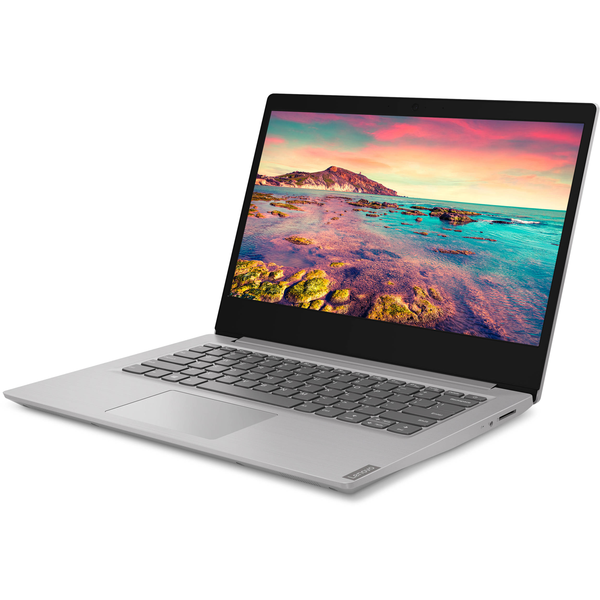

# Laptop Selection Guide for Our Organization

In this guide, we're evaluating three different laptops to determine the best fit for our team.

---

## The Contenders

### 1. Lenovo Ideapad 1

Our CFO originally suggested the [Lenovo Ideapad 1](https://www.bestbuy.com/site/lenovo-ideapad-1-15-6-hd-laptop-athlon-silver-7120u-with-4gb-memory-128gb-ssd-cloud-grey/6531746.p?skuId=6531746). Priced at $299.99, this laptop offers an Athlon Silver 7120U processor, 4GB of RAM, and a 128GB SSD. It's a good fit for basic tasks.

### 2. Lenovo IdeaPad 3i

Mike proposed the [Lenovo IdeaPad 3i](https://www.amazon.com/Lenovo-IdeaPad-Business-Student-i3-1115G4/dp/B0BSR6N4WY/ref=sr_1_2_sspa?crid=31ZBEMBLDQUC1&keywords=lenovo%2Blaptop&qid=1689560155&refinements=p_n_feature_thirty-three_browse-bin%3A23720419011&rnid=23720416011&s=pc&sprefix=lenovo%2B%2Caps%2C196&sr=1-2-spons&sp_csd=d2lkZ2V0TmFtZT1zcF9hdGY&th=1). At $319.99, it's equipped with an Intel Core i3-1115G4 processor, 8GB of RAM, and a 512GB SSD. This laptop can handle more demanding tasks and offers ample storage.

### 3. Dell Inspiron 3420

I suggest the [Dell Inspiron 3420](https://www.bestbuy.com/site/dell-inspiron-3420-14-touch-laptop-snapdragon-8cx-gen-2-8gb-memory-256gb-solid-state-drive-platinum-silver/6525656.p?skuId=6525656&ref=212&loc=1&ref=212&loc=1&gclid=7f1b7c53dd381643e9ab18e57c91ae7a&gclsrc=3p.ds&msclkid=7f1b7c53dd381643e9ab18e57c91ae7a). This 14" touch laptop, priced at $599.99, features a Snapdragon 8cx Gen 2 processor, 8GB of memory, and a 256GB SSD. It combines performance and functionality, offering a touchscreen for interactive tasks.

---

## Our Recommendation

After carefully considering all three options, the **Dell Inspiron 3420** emerges as the best choice. Here's why:

1. **Performance**: The Dell Inspiron 3420 runs on a Snapdragon 8cx Gen 2 processor and has 8GB of memory. This makes it suitable for heavier tasks that our team might encounter, surpassing the performance of the Lenovo Ideapad 1 and the Lenovo IdeaPad 3i.

2. **Touchscreen Functionality**: The inclusion of a touchscreen adds a level of interactivity that's not available in the other two options. This feature could improve productivity and user experience, especially for creative tasks or presentations.

3. **Storage**: With a 256GB SSD, the Inspiron 3420 provides sufficient storage for most of our needs. While it's less than the IdeaPad 3i's 512GB SSD, it's twice as much as the Ideapad 1's 128GB SSD.

Despite its higher price, the Dell Inspiron 3420's superior performance, touchscreen, and decent storage make it the most suitable laptop for our organization.
